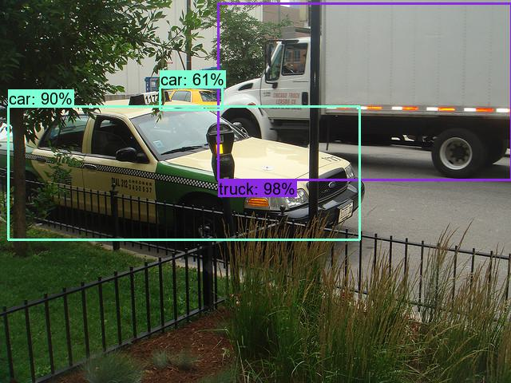

# Visual-Recognition-via-Vision-Language-Model-Transfer


## Claimed
Nanyang Technology University

## Version
Python 3.8

## Guides
### Env
Install pytorch 1.8.1 first, then install 1.7.1

***
-r requirements.txt
***
* This shall be the final env 'master'
### 0.1 version
Jan 16 23.  
Only train the Fast RCNN part first, on COCO2017. The environment 'ResNet50_RCNN' version is different due to the update. 
* still python 3.8
* torch==1.10
* torchvision==0.11.1
Using pre-trained [ResNet50.pth](https://download.pytorch.org/models/resnet50-19c8e357.pth), to train my ResNet50-FasterRCNN.pth
### 0.2 version
Jan 26.  
Full update for libs. Also making the coco dataset in this project.  
Project Folder: refer from [PyTorch: Creating a Custom Dataset for your files](https://pytorch.org/tutorials/beginner/basics/data_tutorial.html#creating-a-custom-dataset-for-your-files)
```
└───the code notebook (.py / .ipynb)  
│  
└───COCOdataset2017     
    └───images  
    │   └───train  
    │   │    │   000000000009.jpg  
    │   │    │   000000000025.jpg  
    │   │    │   ...  
    │   └───val     
    │        │   000000000139.jpg  
    │        │   000000000285.jpg  
    │        │   ...  
    └───annotations  
        │   instances_train.json  
        │   instances_val.json 
```
then
```
pip install git+https://github.com/philferriere/cocoapi.git#egg=pycocotools^&subdirectory=PythonAPI
```
### 0.2.1 version
About to use the [openAi_CLiP](https://github.com/mlfoundations/open_clip).  
And a already trained faster_rcnn_restnet50 model based on [pretrained model](https://download.pytorch.org/models/resnet50-19c8e357.pth).  
A issue: the model already outputs the predicted label, but I only need the proposals (only a img area).


### 0.3 Change
Due to the current GPU limit. Vision recognition will be sematic segmentation. The original codes moved to:  
```
mylittleprogram->master-project-test
```
